# OpenShaderGraph - Grouping and Subgraph Implementation Plan

## Architecture Overview

The project follows a clean 3-layer architecture pattern:

### **Data Layer** (`scripts/core/data/`)
Pure data structures with no dependencies on UI or business logic:
- **BaseGraphData**: Graph container with nodes and connections
- **BaseNodeData**: Individual node data with inputs/outputs  
- **ConnectionData**: Connection between two nodes
- **PinData**: Input/output pin information

### **Logic Layer** (`scripts/core/logic/`)
Business logic and coordination without UI dependencies:
- **EventBus**: Central communication hub (singleton pattern)
- **GraphManager**: Core graph operations and state management
- **PreferencesManager**: User settings and plugin configuration

### **View Layer** (`scripts/core/view/` and `scripts/core/view/ui/`)
UI components that respond to logic layer events:
- **OpenShaderGraphEditor**: Main coordinator between logic and view
- **UIManager**: Orchestrates UI updates based on logic events
- **ShaderGraphEdit**: Pure view component for graph editing
- **All UI Components**: Sidebar, BottomPanel, ContextMenus, etc.

## Current Implementation Status

### ✅ **Completed Features**
- **Multi-tab graph system**: Each graph opens in its own tab
- **Event-driven architecture**: Clean separation using EventBus
- **Graph management**: Create, select, delete graphs with proper state management
- **Tab orchestration**: UIManager coordinates between logic events and UI updates
- **Clean architecture**: Proper separation of Data → Logic → View layers

### 🚧 **In Progress**
- **Visual node rendering**: ShaderGraphEdit.set_graph() needs node instantiation
- **Node-connection visualization**: Display nodes and connections from BaseGraphData

### 📋 **Planned Features**
- **Node creation system**: Context menu → node instantiation
- **Connection system**: Visual connection creation and validation
- **Subgraph navigation**: Enter/exit subgraphs in new tabs
- **Code generation**: Convert graph data to shader code
- **Save/Load system**: Persist graphs to files
- **Undo/Redo system**: Action history management

## Structure Graph

- Plugin Entry: The entry point of the plugin. -> gd_plugin.gd
   - Open Shader Graph Editor: The main editor interface and coordinator.
      - Event Bus: Global signal hub for decoupled communication.
      - Graph Manager: Core graph operations and state management.
         - Node Manager: Manages the creation and deletion of nodes.
         - Connection Manager: Manages the creation and deletion of connections.
         - Resource Manager: Manages the resources.
         - Group Manager: For groups, local subgraphs and subgraphs.
         - Undo/Redo Manager: Handles undo and redo operations.
         - Clipboard Manager: Manages copy/paste data across graphs.
         - Validation Manager: Ensures graph integrity and pin compatibility.
         - Type Conversion Manager: Provides implicit casting between pin types (float to float3, etc.)
         - Code Generation Manager: Generates shader code from the graph.
         - Graph Layout Manager: Arranges nodes, horizontally or vertically or stacked.
      - UI Manager: Orchestrates between logic events and UI updates.
         - MenuBar: Manages the menu bar.
         - GraphTabs (TabContainer): Hosts one tab per open graph, each containing a ShaderGraphEdit.
         - Sidebar: Manages the sidebar.
            - Properties Panel: Manages the properties panel.
         - Bottom Panel: Manages the bottom panel.
            - Console: To see errors and warnings.
            - Shader Code: To see the generated shader code.
         - Context Menu Manager: Manages the context menu.
            - Creation Popup: List of all node types.
            - Node Context Menu: Context menu for nodes.
            - Grouping Context Menu: Context menu for grouping nodes.
   - Node Types:
      - Base Node: The base node class.
         - Constant nodes
         - Grouping nodes
         - Math nodes
         - Utility nodes
         - Input nodes
         - Output nodes
   - Preferences Manager: Stores user and plugin settings.

## Signal Flow Architecture

```
User Action → OpenShaderGraphEditor (Orchestrator)
                     ↓ (direct calls)
               GraphManager (Logic)
                     ↓ (signals)
          OpenShaderGraphEditor (Orchestrator)
                     ↓ (direct calls)
               UIManager (View)
```

**Key Principles:**
- **View → Parent**: UI components emit signals to their parent
- **Parent → Child**: Parents call child methods directly
- **Orchestrator Pattern**: OpenShaderGraphEditor acts as the central orchestrator
- **No Sibling Communication**: Components never call methods on siblings directly
- **Signal Chain**: Signals bubble up through the parent hierarchy

**Signal Flow Examples:**

1. **Menu Selection:**
   ```
   MenuBar.signal → Sidebar.signal → UIManager.signal → OpenShaderGraphEditor
   ```

2. **Graph Creation:**
   ```
   OpenShaderGraphEditor → GraphManager.create_new_graph()
   GraphManager.signal → OpenShaderGraphEditor → UIManager.on_graph_created()
   ```

3. **Tab Selection:**
   ```
   TabContainer.signal → UIManager.signal → OpenShaderGraphEditor → GraphManager.select_graph()
   ```

**Architecture Benefits:**
- Clear separation of concerns
- Testable components (no global dependencies)
- Predictable signal flow
- Easy to debug and maintain
- Follows Godot best practices

```mermaid
graph TD;
    plugin["Plugin Entry<br/>(gd_plugin.gd)"];
    editor["Open Shader Graph Editor"];
    plugin --> editor;

    editor --> eventBus["Event Bus"];

    editor --> graphMgr["Graph Manager"];
    subgraph "Graph Manager"
        nodeMgr["Node Manager"]
        connectionMgr["Connection Manager"]
        resourceMgr["Resource Manager"]
        groupMgr["Group Manager"]
        undoMgr["Undo/Redo Manager"]
        clipboardMgr["Clipboard Manager"]
        validationMgr["Validation Manager"]
        typeConvMgr["Type Conversion Manager"]
        codeGenMgr["Code Generation Manager"]
        layoutMgr["Graph Layout Manager"]
    end
    graphMgr --> nodeMgr;
    graphMgr --> connectionMgr;
    graphMgr --> resourceMgr;
    graphMgr --> groupMgr;
    graphMgr --> undoMgr;
    graphMgr --> clipboardMgr;
    graphMgr --> validationMgr;
    graphMgr --> typeConvMgr;
    graphMgr --> codeGenMgr;
    graphMgr --> layoutMgr;

    editor --> uiMgr["UI Manager"];
    subgraph "UI Manager"
        menubar["MenuBar"]
        graphTabs["GraphTabs (TabContainer)"]
        sidebar["Sidebar"]
        bottomPanel["Bottom Panel"]
        contextMenuMgr["Context Menu Manager"]
    end
    uiMgr --> menubar;
    uiMgr --> graphTabs;
    uiMgr --> sidebar;
    uiMgr --> bottomPanel;
    uiMgr --> contextMenuMgr;

    subgraph "Sidebar"
        propertiesPanel["Properties Panel"]
    end
    sidebar --> propertiesPanel;

    subgraph "Bottom Panel"
        console["Console"]
        shaderCode["Shader Code"]
    end
    bottomPanel --> console;
    bottomPanel --> shaderCode;

    subgraph "Context Menu Manager"
        creationPopup["Creation Popup"]
        nodeContext["Node Context Menu"]
        groupingContext["Grouping Context Menu"]
    end
    contextMenuMgr --> creationPopup;
    contextMenuMgr --> nodeContext;
    contextMenuMgr --> groupingContext;

    editor --> nodeTypes["Node Types"];
    subgraph "Node Types"
        baseNode["Base Node"]
        constantNodes["Constant nodes"]
        groupingNodes["Grouping nodes"]
        mathNodes["Math nodes"]
        utilityNodes["Utility nodes"]
        inputNodes["Input nodes"]
        outputNodes["Output nodes"]
    end
    nodeTypes --> baseNode;
    baseNode --> constantNodes;
    baseNode --> groupingNodes;
    baseNode --> mathNodes;
    baseNode --> utilityNodes;
    baseNode --> inputNodes;
    baseNode --> outputNodes;

    editor --> prefsMgr["Preferences Manager"];
```

