# OpenShaderGraph - Grouping and Subgraph Implementation Plan

## Structure graph
- Plugin Entry: The entry point of the plugin. -> gd_plugin.gd
   - Open Shader Graph Editor: The main editor interface.
      - Event Bus: Global signal hub for decoupled communication.
      - Graph Manager: Manages the graph.
         - Node Manager: Manages the creation and deletion of nodes.
         - Connection Manager: Manages the creation and deletion of connections.
         - Resource Manager: Manages the resources.
         - Group Manager: For groups, local subgraphs and subgraphs.
         - Undo/Redo Manager: Handles undo and redo operations.
         - Clipboard Manager: Manages copy/paste data across graphs.
         - Validation Manager: Ensures graph integrity and pin compatibility.
         - Type Conversion Manager: Provides implicit casting between pin types (float to float3, etc.)
         - Code Generation Manager: Generates shader code from the graph.
         - Graph Layout Manager: Arranges nodes, horizontally or vertically or stacked.
      - UI Manager: Manages the UI like Properties Panel, MenuBar, GraphEdit, Popup Context Menu, etc.
         - MenuBar: Manages the menu bar.
         - GraphEdit: Manages the graph edit.
         - Sidebar: Manages the sidebar.
            - Graphs List: List of all opened graphs.
            - Properties Panel: Manages the properties panel.
         - Bottom Panel: Manages the bottom panel.
            - Console: To see errors and warnings.
            - Shader Code: To see the generated shader code.
         - Context Menu Manager: Manages the context menu.
            - Creation Popup: List of all node types.
            - Node Context Menu: Context menu for nodes.
            - Grouping Context Menu: Context menu for grouping nodes.
   - Node Types:
      - Base Node: The base node class.
         - Constant nodes
         - Grouping nodes
         - Math nodes
         - Utility nodes
         - Input nodes
         - Output nodes
   - Preferences Manager: Stores user and plugin settings.

```mermaid
graph TD;
    plugin["Plugin Entry<br/>(gd_plugin.gd)"];
    editor["Open Shader Graph Editor"];
    plugin --> editor;

    editor --> eventBus["Event Bus"];

    editor --> graphMgr["Graph Manager"];
    subgraph "Graph Manager"
        nodeMgr["Node Manager"]
        connectionMgr["Connection Manager"]
        resourceMgr["Resource Manager"]
        groupMgr["Group Manager"]
        undoMgr["Undo/Redo Manager"]
        clipboardMgr["Clipboard Manager"]
        validationMgr["Validation Manager"]
        typeConvMgr["Type Conversion Manager"]
        codeGenMgr["Code Generation Manager"]
        layoutMgr["Graph Layout Manager"]
    end
    graphMgr --> nodeMgr;
    graphMgr --> connectionMgr;
    graphMgr --> resourceMgr;
    graphMgr --> groupMgr;
    graphMgr --> undoMgr;
    graphMgr --> clipboardMgr;
    graphMgr --> validationMgr;
    graphMgr --> typeConvMgr;
    graphMgr --> codeGenMgr;
    graphMgr --> layoutMgr;

    editor --> uiMgr["UI Manager"];
    subgraph "UI Manager"
        menubar["MenuBar"]
        graphEdit["GraphEdit"]
        sidebar["Sidebar"]
        bottomPanel["Bottom Panel"]
        contextMenuMgr["Context Menu Manager"]
    end
    uiMgr --> menubar;
    uiMgr --> graphEdit;
    uiMgr --> sidebar;
    uiMgr --> bottomPanel;
    uiMgr --> contextMenuMgr;

    subgraph "Sidebar"
        graphsList["Graphs List"]
        propertiesPanel["Properties Panel"]
    end
    sidebar --> graphsList;
    sidebar --> propertiesPanel;

    subgraph "Bottom Panel"
        console["Console"]
        shaderCode["Shader Code"]
    end
    bottomPanel --> console;
    bottomPanel --> shaderCode;

    subgraph "Context Menu Manager"
        creationPopup["Creation Popup"]
        nodeContext["Node Context Menu"]
        groupingContext["Grouping Context Menu"]
    end
    contextMenuMgr --> creationPopup;
    contextMenuMgr --> nodeContext;
    contextMenuMgr --> groupingContext;

    editor --> nodeTypes["Node Types"];
    subgraph "Node Types"
        baseNode["Base Node"]
        constantNodes["Constant nodes"]
        groupingNodes["Grouping nodes"]
        mathNodes["Math nodes"]
        utilityNodes["Utility nodes"]
        inputNodes["Input nodes"]
        outputNodes["Output nodes"]
    end
    nodeTypes --> baseNode;
    baseNode --> constantNodes;
    baseNode --> groupingNodes;
    baseNode --> mathNodes;
    baseNode --> utilityNodes;
    baseNode --> inputNodes;
    baseNode --> outputNodes;

    editor --> prefsMgr["Preferences Manager"];
```

