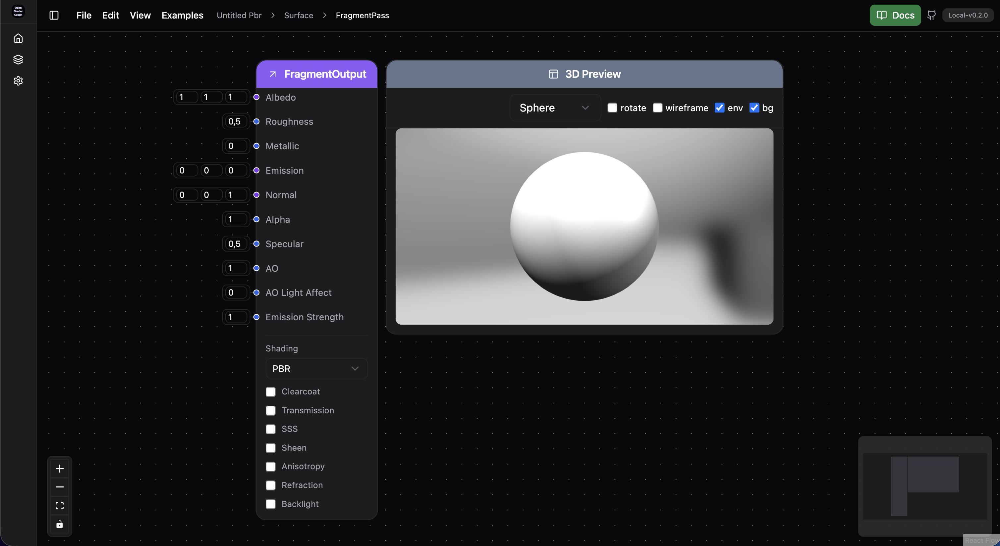
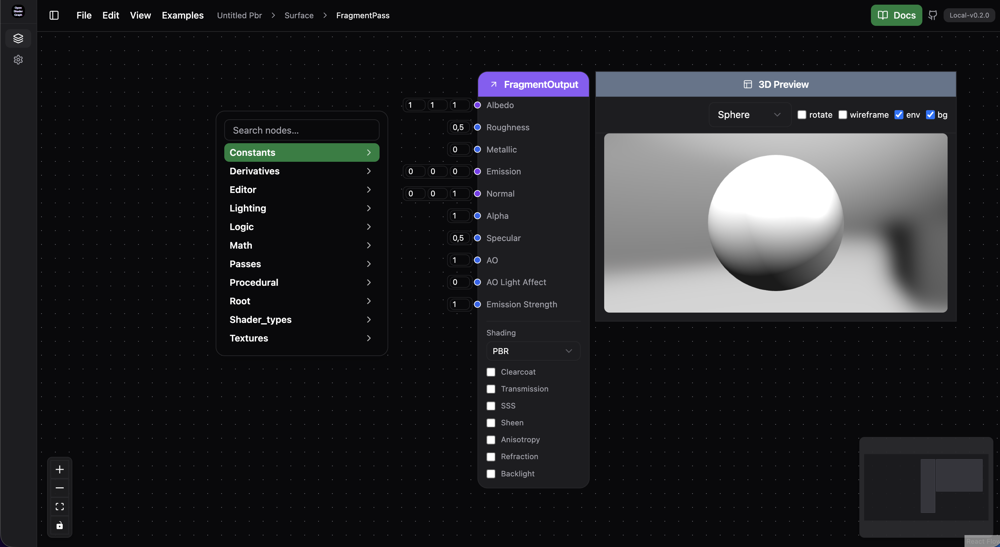

# Getting Started (Artists)

This guide focuses on creating your first material in the graph editor. Technical setup is covered separately in [Developers](developers.md).

## Create Your First Material

1- From main menu, click on 'File' -> 'New' -> 'PBR'.
This will create a new PBR graph and show the fragment pass by default.

[{ width="700" loading=lazy }](./assets/01_newgraph.png){ .glightbox }

## Graph Structure

Notice that in the top bar, you see **`Untitled Pbr > Surface > FragmentPass`**.
A new PBR graph (Unlit and Toon are also the same) is structured like this:

## Navigation

You can click on the breadcrumb to navigate to the parent nodes or double click on a group node like `Surface` or `FragmentPass` to navigate to the node details.
Lets navigate to the `FragmentPass` node to start creating our first shader.

## Adding nodes

### Right click context menu

You can right click on the graph to open the context menu.
[{ width="700" loading=lazy }](./assets/02_addnode_context_menu.png){ .glightbox }

Here tou can search for a node by name or type and add it to the graph.

### Using hotkeys

You can use the hotkeys to add nodes to the graph.

1. Add a `Color` node and pick a color.
2. Add `FragmentOutput` and connect `Color.out` → `Albedo`.
3. Adjust `Roughness` and `Metallic` for the look you want.

Tip: You can connect any node that outputs a color (float3/float4) to `Albedo`.

## Build Variations Quickly

- Try `Add` or `Multiply` to combine colors.
- Use `UV` and `Texture` nodes to sample images.
- Drive `Emission` with bright colors for glow.

## Examples to Load

- Basic Color
- Addition (Color + Color)

Open Tutorials next for step‑by‑step walkthroughs.
