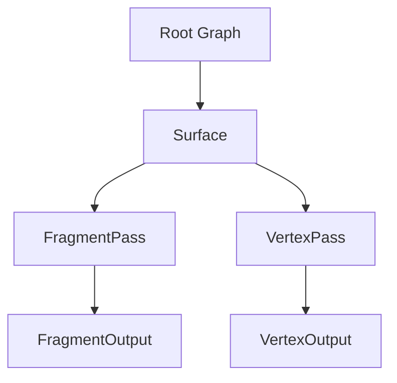

# Getting Started

Welcome to OpenShaderGraph! This guide will help you create your first shader material using the graph editor. For technical setup and development information, see [Developers](developers.md).

## Your First Material

### 1. Create a New Graph

From the menu bar, select **File → New → PBR** to create a new PBR material graph.

<iframe
    src="/viewer.html"
    width="100%"
    height="360"
    style="border: 1px solid #2a2a2a; border-radius: 8px;"
    loading="lazy"
    referrerpolicy="no-referrer"
    data-graph='{"v":1,"nodes":[{"id":101,"t":"fragment_output","x":260,"y":140}],"edges":[]}'
></iframe>

!!! note "Graph Types"

    You also can choose between **PBR**, **Unlit**, or **Toon** shading. All three follow the same graph structure.

### 2. Understanding Graph Structure

The breadcrumb at the top shows your current location: **`Untitled Pbr > Surface > FragmentPass`**

A new material graph is organized hierarchically:

- **Surface**: Container for vertex and fragment rendering passes
- **FragmentPass**: Where you build your material's appearance (color, roughness, etc.)
- **VertexPass**: Where you control vertex positions and attributes
- **Output nodes**: Final connection points that feed into the engine

In OpenShaderGraph, every layer is a node. it is either a composition node or a primitive node. (Yes, inspired by OpenUSD!)

- Composition nodes are nodes that contain other nodes.
- Primitive nodes are nodes that do **not** contain other nodes.

!!! tip "Navigation"

    - Click breadcrumb items to navigate up the hierarchy
    - Double-click a group node (like `Surface`) to drill down into its contents

## Core Workflows

### Adding Nodes

**Method 1: Context Menu**

Right-click anywhere on the canvas to open the node menu. Search by name or browse categories.

**Method 2: Quick Hotkeys**

Use keyboard shortcuts to spawn commonly-used nodes instantly. Configure shortcuts in **Settings → Quick Node Hotkeys** (sidebar).

- Default: **Cmd+Shift** (macOS) or **Ctrl+Shift** (Windows/Linux) + key

!!! tip "Connection Tips"

    - Compatible pins snap when hovering
    - Delete a connection by clicking on the connction line and pressing **Delete** or **Backspace**
    - Right-click a connection for more options

### Editing Values

Click input fields directly on nodes to edit values:

- **Numbers**: Type directly `or drag to scrub or shift + drag to scrub faster (TODO)`
- **Colors**: Click the swatch to open a color picker
- **Vectors**: Edit individual components

## Working with Textures

To use a texture in your shader:

1. **Add the Assets panel**: Right-click → add `Assets` editor node

<iframe
    src="/viewer.html"
    width="100%"
    height="360"
    style="border: 1px solid #2a2a2a; border-radius: 8px;"
    loading="lazy"
    referrerpolicy="no-referrer"
    data-graph='{"v":1,"nodes":[{"id":101,"t":"editor_assets","x":260,"y":140}],"edges":[]}'
></iframe>

2. **Drag & drop**: Drag a texture from the Assets panel onto the canvas to create a `Texture` node
3. **Add a sampler**: Create a `TextureSampler` node
4. **Connect**: `Texture.texture` → `TextureSampler.texture`
5. **Use the output**: Connect `TextureSampler.rgb` to your material inputs

!!! info "UV Coordinates"

    The sampler's `uv` input uses built-in UVs by default. Connect a `UV` node to override or transform coordinates.

## Editor Nodes

Editor Nodes provide tools and information but **don't affect generated shader code**. Add them via the context menu:

- **3D Preview**: Real-time material preview with lighting
- **Assets**: Manage textures and models
- **Compile Output**: View generated shader code
- **Graph Data**: Inspect graph structure (JSON)
- **Properties**: Quick access to selected node properties
- **Value Probe**: Debug pin values in real-time

## Previewing Your Work

The **3D Preview** panel renders your material in real-time using a three-point lighting setup.

[{ width="700" loading=lazy }](./assets/04_preview_panel.png){ .glightbox }

- Switch between **Sphere**, **Cube**, **Cylinder**, or **Model** (requires model asset)
- Preview always uses `ThreeJS_GLSL` internally, regardless of export language
- Lighting is preview-only—generated shader code remains environment-agnostic

## Exporting Shader Code

Open the **Compile Output** panel to see your shader as code.

[{ width="700" loading=lazy }](./assets/07_compile_output.png){ .glightbox }

- Default output: **Godot** shading language
- Switch languages from the dropdown
- Click **Copy** to export code to your clipboard
- Your graph is the source of truth—code is generated on the fly

## Saving Your Work

**File → Save** or **File → Save As** to store your graph.

[{ width="700" loading=lazy }](./assets/08_save_graph.png){ .glightbox }

- Graphs are saved as `.json` files
- Recent files appear in **File → Open Recent**
- Load example graphs from the **Examples** menu

## Hands-On Tutorial: Color + Texture Blend

Let's build a simple material that blends a solid color with a texture.

**Step 1**: Load the starting point

- **Examples → Basic Color** to load a simple colored material

[{ width="700" loading=lazy }](./assets/09_open_example_basic_color.png){ .glightbox }

**Step 2**: Add editor tools

- Right-click → add **3D Preview**, **Assets**, and **Compile Output** panels

[{ width="700" loading=lazy }](./assets/10_editor_nodes_panels.png){ .glightbox }

**Step 3**: Create a texture node

- Drag a texture from the **Assets** panel onto the canvas

[{ width="700" loading=lazy }](./assets/11_assets_drag_texture.png){ .glightbox }

**Step 4**: Add a texture sampler

- Right-click → add **TextureSampler**
- Connect `Texture.texture` → `TextureSampler.texture`

[{ width="700" loading=lazy }](./assets/12_texture_sampler_wiring.png){ .glightbox }

**Step 5**: Blend with Lerp

- Add a **Lerp** node and a **Float** node
- Connect `Color.out` → `Lerp.a`
- Connect `TextureSampler.rgb` → `Lerp.b`
- Connect `Float.out` → `Lerp.t` (set to `0.5` for 50/50 blend)

[{ width="700" loading=lazy }](./assets/13_lerp_setup.png){ .glightbox }

**Step 6**: Output the result

- Connect `Lerp.out` → `FragmentOutput.Albedo`

[{ width="700" loading=lazy }](./assets/14_lerp_result_preview.png){ .glightbox }

Try adjusting the Float value to change the blend ratio!

## What's Next?

- **Tutorials**: Step-by-step guides for common tasks
  - [Basic Color Setup](tutorials/basic-color.md)
  - [Adding Two Colors](tutorials/add-color-color.md)
- **[Features Overview](features.md)**: Explore advanced capabilities
- **[Developers Guide](developers.md)**: Setup for contributors and developers
