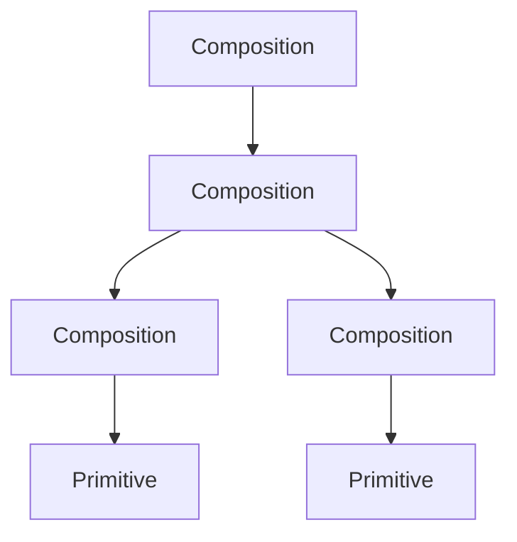

# Getting Started

Welcome to OpenShaderGraph! This guide will help you create your first shader material using the graph editor. For technical setup and development information, see [Developers](developers.md).

## Your First Shader

### 1. Create a New Graph

!!! example "Try this"

    === "Exercise"

        1. From the menu bar select **File → New → PBR** to create a new PBR material graph.
        2. Notice the breadcrumb at the top of the app. It should show **`Untitled Pbr > Surface > FragmentPass`**.
        3. Open the Preview overlay from the menu bar (**View → Preview**).
        4. Use **View → Compile** to pop out the compile overlay.

    === "Expected result"

        - The breadcrumb displays **`Untitled Pbr > Surface > FragmentPass`**.
        - You should have a **FragmentOutput** node on the canvas.
        - Floating Preview and Compile overlays appear above the canvas; you can drag them wherever you like.

### 2. Understanding Graph Structure

As you've seen, the breadcrumb at the top shows your current location in the graph. something like:

**`Untitled Pbr > Surface > FragmentPass`**

<!--
<button onclick="window.parent.postMessage({ type: 'LOAD_EXAMPLE_GRAPH', key: 'doc/simple_pbr' }, window.location.origin)" class="md-button md-button--secondary">Load Example Graph</button> -->

In OpenShaderGraph, every layer is a node. it is either a composition node or a primitive node. (Yes, inspired by OpenUSD!)

- Composition nodes are nodes that contain other nodes.
- Primitive nodes are nodes that do **not** contain other nodes.

For the pbr graph, you just created, the hierarchy is:

- **Surface**: Container for vertex and fragment rendering passes
- **FragmentPass**: Where you build your material's surface appearance (color, roughness, etc.)
- **VertexPass**: Where you control vertex positions and attributes
- **Output nodes**: Nodes like Vertex and fragment output nodes are final connection points that feed into the engine.

!!! example "Try this"

    === "Exercise"

        1. Click breadcrumb items to navigate up the hierarchy
        2. Double-click a composition node (like `Surface`) to drill down into its contents

    === "Expected result"

        - You should be able to navigate up and down the hierarchy.
        - You should be able to drill down into the contents of a composition node.

## Core Workflows

### Adding Nodes

**Method 1: Context Menu**

Right-click anywhere on the canvas to open the node menu. Search by name or browse categories.

**Method 2: Quick Hotkeys**

Use keyboard shortcuts to spawn commonly-used nodes instantly. Configure shortcuts in **Settings → Quick Node Hotkeys** (sidebar).

- Default: **Cmd+Shift** (macOS) or **Ctrl+Shift** (Windows/Linux) + key

!!! example "Try this"

    === "Exercise"
        1. Try both methods of adding nodes to the graph.
        2. Add a new hotkey to create a UV node. my recommendation is to use **U** so pressing **Cmd+Shift+U** will create a UV node.

    === "Expected result"

        - You should be able to add nodes to the graph using both methods.
        - You should be able to create a UV node using your new hotkey.

### Editing Values

Click input fields directly on nodes to edit values:

- **Numbers**: Type directly `or drag to scrub or shift + drag to scrub faster (TODO)`
- **Colors**: Click the swatch to open a color picker
- **Vectors**: Edit individual components

### Connecting Nodes

To connect nodes, simply drag and drop the output pin of one node to the input pin of another node.

!!! example "Try this"

    === "Exercise"
        1. Add a Color node to the graph.
        2. Connect from the output of the Color node to the Albedo input of the FragmentOutput node.
        3. Change the color of the Color node and see the preview update.

    === "Expected result"

        - You should be able to connect nodes to the graph.
        - You should be able to change the color of the Color node and see the preview update.

!!! tip "Connection Tips"

    - Compatible pins snap when hovering
    - Delete a connection by selecting the connction line and pressing **Delete** or **Backspace**
    - You can double click on a connection line to create a re-route node.

## Editor Panels & Overlays

Editor tools now live in floating overlays that **don't affect generated shader code**. Toggle them from the menu bar (**View**) or the background context menu (**View → ...**). Overlays remember their size and position across graphs.

- **Preview**: Real-time material preview with lighting
- **Compile**: View generated shader code
- **Graph Data**: Inspect graph structure (JSON)
- **Assets**: Manage textures and models
- **Properties**: Quick access to the selected node's properties

The **Value Probe** remains a graph node. Add it from the context menu to sample pin values in real-time.

## Working with Textures

To use a texture in your shader, open the **Assets** overlay and drag textures from there into the graph.

!!! example "Try this"

    === "Exercise"
        1. Toggle the **Assets** overlay from the View menu.
        2. Drag and drop the texture into the graph.
        3. Create a **TextureSampler** node.tex
        4. Connect the **Texture.texture** pin to the **TextureSampler.texture** pin.
        5. Connect the **TextureSampler.rgb** pin to the **FragmentOutput.Albedo** pin.

    === "Expected result"

        - You should be able to see the texture applied in the Preview overlay.

## Using the shader in your project

!!! example "Try this"

    === "Exercise"
        1. Open the **Compile** overlay from the View menu.
        2. From the top menu select **File → Export → &lt;language&gt;** (menu entries show the language `name`, e.g. "ThreeJS GLSL" or "Godot").
        3. The editor compiles the active graph using the selected language template. In Chromium-based browsers (Chrome, Edge, Arc, etc.) you'll be prompted once to choose a destination on disk; other browsers automatically download the generated shader using the language's primary file extension (for example `.glsl` or `.gdshader`).
        4. After saving to disk in a Chromium browser, a **Quick Export** button appears in the header so you can overwrite the same file with a single click or the ⌘⇧E / Ctrl+Shift+E hotkey.

    === "Expected result"

        - A file named like `UntitledPbr.glsl` or `UntitledPbr.gdshader` (based on your graph name and chosen language) is written to the selected destination or downloaded to your machine.
        - The downloaded shader is produced from the active graph and should visually match the 3D Preview when equivalent lighting and uniform values are provided.
        - After exporting to disk once, the header shows a **Quick Export** button alongside the current hotkey. Clicking it (or pressing the shortcut) recompiles the active graph and overwrites the previously saved shader file. This workflow requires a Chromium browser because it relies on the File System Access API.

You can change the Quick Export hotkey under **Settings → Action Hotkeys** if the default ⌘⇧E / Ctrl+Shift+E conflicts with another shortcut.
